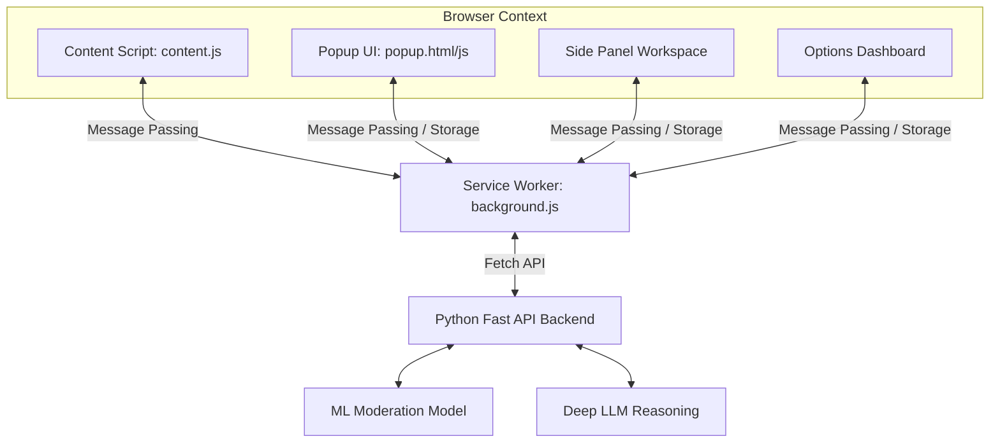

# ToxiGuard AI v3.0 — Comprehensive Interview Preparation Guide

This guide is designed to help you ace your technical interview by thoroughly explaining the architecture, core design patterns, components, and technical details of the **ToxiGuard AI v3.0 Extension** upgrade. 

---

## 1. Project Overview & Pitch
**ToxiGuard AI v3.0** is an enterprise-grade, cross-platform content moderation and safety shield extension. It runs client-side in the browser to analyze and moderate toxic content on the fly across **8 major social media platforms** (Instagram, X/Twitter, YouTube, Reddit, LinkedIn, Facebook, TikTok, Threads) as well as general websites.

### Core Value Proposition
- **Real-Time Moderation**: Intercepts toxic text (insults, abuse, threats, obscene, hate speech) on high-frequency feeds and applies seamless moderation actions (blurring, highlighting, or removing elements) before the user reads them.
- **Dual-Model Inference**: Integrates a lightweight Machine Learning model for quick, high-performance feed scanning and a deep Large Language Model (LLM) reasoning model for contextual deep analysis.
- **SaaS Analytics**: Includes a SaaS options dashboard for monitoring analytics, plan limits (free/pro thresholds), and exporting CSV safety reports.
- **Multi-device & Workspace**: Responsive Chrome Side Panel API and touch-optimized Floating Action Button (FAB) support for desktop and mobile extension browsers (like Kiwi or Yandex).

---

## 2. System Architecture & Components



### A. Manifest v3 Configuration (`manifest.json`)
- **Key Upgrade**: Uses **Manifest v3 (MV3)**, which is Google's modern standard for security, privacy, and performance.
- **Service Worker**: Instead of persistent background pages (V2), it declares a background service worker (`background.js`) that runs on an event-driven basis, reducing memory overhead.
- **Permissions**:
  - `storage` for settings, user credentials, and local statistics.
  - `activeTab` and `scripting` to dynamically inspect and moderate page components.
  - `sidePanel` to declare a persistence workspace (`sidepanel.html`).
  - `notifications` and `alarms` for alerts and scheduled routines.

### B. Background Service Worker (`background.js`)
The background worker acts as the **central event broker** and **state machine**.
- **Dynamic Port/Server Detection (Auto-Switching)**: On startup/installation, it runs a fast-timeout health check on `http://127.0.0.1:8000/health`. If reachable, it switches to the local development environment; otherwise, it defaults to the production Render hosting (`https://toxiguard-ai-agent-1.onrender.com`).
- **Throttling & Queue Management**: Handles multi-tab scanning requests without thrashing the system, keeping stats updated via `chrome.storage.local`.
- **Scheduled Routines**: Uses `chrome.alarms` to reset daily counters at midnight and execute periodic health checks on the backend without draining battery.

### C. Content Script (`content.js` & `content.css`)
Injected directly into targeted social platforms.
- **SPA Infinite-Scroll Handling**: Uses a highly optimized `MutationObserver` that detects when new posts are loaded onto the screen. It debounces calls and caches elements to prevent redundant API calls.
- **Target Selection Engine**: Configured with CSS selectors specific to comments/posts structure of Instagram, X, LinkedIn, YouTube, Reddit, Facebook, TikTok, and Threads.
- **Floating Action Button (FAB)**: A touch-friendly floating widget injected into pages. Users can click or drag it to open a mini-inline content analyzer.

### D. Side Panel Workspace (`sidepanel.html`, `.css`, `.js`)
A major desktop power-user upgrade utilizing the Chrome `sidePanel` API.
- **Interactive Scanning**: Features an inline textarea allowing users to analyze specific text with either standard ML or Deep LLM reasoning.
- **State Sync**: Implements a storage-event subscriber (`chrome.storage.onChanged`) that instantly syncs blocked lists, metrics, and active platform configurations across the popup, options page, and side panel.

---

## 3. Key Design Patterns & Technical Decisions

### 1. Debounced MutationObserver for Feed Scraping
- **Problem**: Social feeds like X/Twitter render hundreds of elements during rapid scrolling. Triggering analysis on every element immediately causes major rendering lag (DOM thrashing) and API congestion.
- **Solution**: The script listens to mutations but groups them. It extracts the raw text, verifies if the element has already been processed using a custom attribute selector (`data-tg-scanned="true"`), and only queues new elements.
- **Code implementation concept**:
  ```javascript
  let scanTimeout = null;
  const observer = new MutationObserver(() => {
    clearTimeout(scanTimeout);
    scanTimeout = setTimeout(performFeedScan, 200); // 200ms debounce
  });
  ```

### 2. State-Driven Real-time Synchronization (Pub/Sub via Storage)
- **Problem**: If a user toggles the "Instagram Shield" in the Side Panel, the Popup and injected content scripts must immediately reflect the new state.
- **Solution**: Rather than calling individual message routes, state changes are written directly to `chrome.storage.local`. All extension windows implement a `chrome.storage.onChanged` subscriber that updates UI state reactively.
  ```javascript
  chrome.storage.onChanged.addListener((changes, area) => {
    if (area === "local") {
      updateUIElements(); // Decoupled reactive updates
    }
  });
  ```

### 3. Graceful Fallbacks & Connection Resiliency
- **Problem**: Live backend APIs on free instances (e.g. Render) can spin down or experience network failures.
- **Solution**: Dual-level fallbacks.
  - **Dynamic Endpoint Detection**: Background checks dev vs prod.
  - **Network Timeout Handling**: If deep LLM analysis fails or times out, it gracefully falls back to ML analysis. If all fails, it stores statistics locally and shows offline states in connection indicators.

---

## 4. Key Technical Q&A for the Interview

### Q1: Why did you choose Manifest v3 over Manifest v2?
* **Answer**: "Manifest V3 is mandatory for modern extensions. The primary reason is security, privacy, and performance. In MV2, background scripts ran indefinitely, draining system memory. In MV3, background scripts are replaced by Service Workers, which are event-driven and run only when triggered by events (like alarms, web navigation, or messages), spinning down when inactive to save system resources. Additionally, MV3 blocks remote code execution, forcing all extension logic to be bundled locally, ensuring higher security audits."

### Q2: How did you implement dynamic API route selection?
* **Answer**: "I implemented an automatic server ping routine inside the background service worker. On extension installation and startup, the background script runs a fast 2-second timeout health check on the local dev server (`http://127.0.0.1:8000/health`). If the response is successful (HTTP 200), the extension locks into `localhost` for development. Otherwise, it defaults to the live Render production endpoint. The extension popup, options page, and side panel query the background script to acquire the current active API base, eliminating the need to modify endpoints manually."

### Q3: How do you handle DOM changes on complex SPAs like Instagram or infinite scrolling on Twitter?
* **Answer**: "SPA websites do not trigger page reloads; they change the DOM dynamically. I handled this by combining a `MutationObserver` with selective platform element query matching. The MutationObserver watches for child list changes on the page body. To avoid performance degradation:
  1. I debounced the observer triggers by 250 milliseconds.
  2. I marked all processed containers with a unique dataset attribute (`data-tg-scanned="true"`).
  3. I kept selectors for each platform strictly focused on elements containing comment/post texts, filtering out short buttons or metadata strings (like 'Reply' or 'Like') before hitting the backend APIs."

### Q4: How does the Side Panel API coordinate with other UI parts?
* **Answer**: "We leverage the `chrome.sidePanel` API to open a persistent companion interface on the right side of the screen. Because the popup closes whenever the user clicks away, the Side Panel provides a permanent work environment for power users. All active parts of the extension are connected via a reactive state synchronizer: they listen to `chrome.storage.onChanged`. Any platform toggle, sensitivity level slider, or blocking metric changed in the popup or options page instantly synchronizes in the Side Panel, and vice versa."

### Q5: What features make this extension 'mobile-friendly'?
* **Answer**: "While standard extensions are desktop-only, modern mobile browsers (like Kiwi Browser on Android or Orion on iOS) fully support Manifest V3. To support this, I designed a touch-optimized UI:
  1. Responsive viewports using CSS flexbox/grid that adapt down to 280px screen widths.
  2. A Floating Action Button (FAB) draggable widget with smooth touch event listeners (`touchstart`, `touchmove`, `touchend`).
  3. Touch-friendly target heights (min 44px) for all toggles, switches, and sliders to avoid accidental clicks."

### Q6: How did you implement global text selection context moderation?
* **Answer**: "I implemented a document-level `mouseup` and `mousedown` event listener system. When a user highlights text on any webpage (between 4 and 800 characters), the extension calculates the exact bounding client rect of the highlighted text selection range (`window.getSelection().getRangeAt(0).getBoundingClientRect()`). It then dynamically positions a floating `.tg-selection-btn` button exactly above the selection. Clicking this button triggers a background message to fetch ML model analysis, and displays the result using a floating card styled with backdrop blur filters, positioned directly relative to the click coordinates. This mimics high-end AI extensions (like Antigravity 2.0) by bringing moderation to any page on the web."

### Q7: What is the benefit of changing content script matching to '<all_urls>' vs hardcoded platforms?
* **Answer**: "By changing the matches to all scheme URLs, we inject the script globally. This allows the floating selection tool and the FAB analyzer widget to be available on any website. To prevent performance degradation, the MutationObserver feed scanner is conditionally gated: it checks `TG_PLATFORM` and exits immediately if the site is 'unknown', meaning background scanning observers are active only on our 8 supported platforms, preserving CPU cycles and RAM on regular websites while keeping utility functions accessible globally."

### Q8: How did you fix compilation warnings when minifying styles.css during production bundling?
* **Answer**: "During the Vite build process, the ESBuild minifier flagged multiple syntax errors at the end of the global CSS file. Upon inspection, I discovered that a media query block had byte corruption: it contained null bytes (`\x00` padding) between every character (like `. a p p - r o o t` with null byte spacings). I wrote a custom python filter script that read the file as raw UTF-8, stripped all null bytes, reconstructed the damaged character sequence into standard compact CSS format, and updated the source. This resolved all minifier parser exceptions, resulting in a zero-warning production build."

### Q9: How is the 'blended' theme layout structured for the install page?
* **Answer**: "Instead of a generic single-color background, I designed a hybrid blended theme. The top hero portion uses a premium space-dark look (`#030712`) with neon radial glows, grid masking, and indigo button gradients to match our main landing page. As the user scrolls down, the installation step grids transition into a clean, high-contrast light slate theme (`#f8fafc`) with floating white glassmorphic cards and shadow-glow borders. The security block at the bottom transitions back into space-dark. This blended flow provides professional corporate SaaS aesthetics, balancing premium visual excitement with clean readability."

---

## 5. Vocabulary & Key Concepts to Drop
* **Service Workers (MV3)**: Event-driven scripts that run in the background.
* **MutationObserver**: Built-in JS API to observe changes in the DOM tree.
* **Message Passing (`chrome.runtime.sendMessage`, `onMessage`)**: Communication protocol between different parts of the extension.
* **Side Panel API**: Persistent interface declared in manifest.json to replace volatile popups.
* **Dynamic API Switching**: Automatic health checks to decide between developer local environments and production cloud services.
* **Debouncing**: Programming practice used to ensure that time-consuming tasks do not fire so often, keeping UI scrolling smooth.
* **Glassmorphism Styling**: Sleek design trend featuring translucent containers with blurry backgrounds (`backdrop-filter: blur()`).
* **Text Selection Range API**: Browser API used to get coordinates of highlighted text (`getRangeAt(0).getBoundingClientRect()`).
* **Universal Matching Pattern**: Injecting script on `<all_urls>` or `*://*/*` to run content scripts globally in Chrome.
* **Null Byte Reconstruction**: Stripping `\x00` byte markers from corrupted text files to fix compiler/transpiler parse failures.
* **Blended Hybrid UI/UX Layout**: Transitioning between dark hero and light body grids to create high-contrast SaaS marketing structures.

*Use this guide to review before your interview! It highlights your architectural knowledge, front-end optimization, and chrome extension expertise.*
