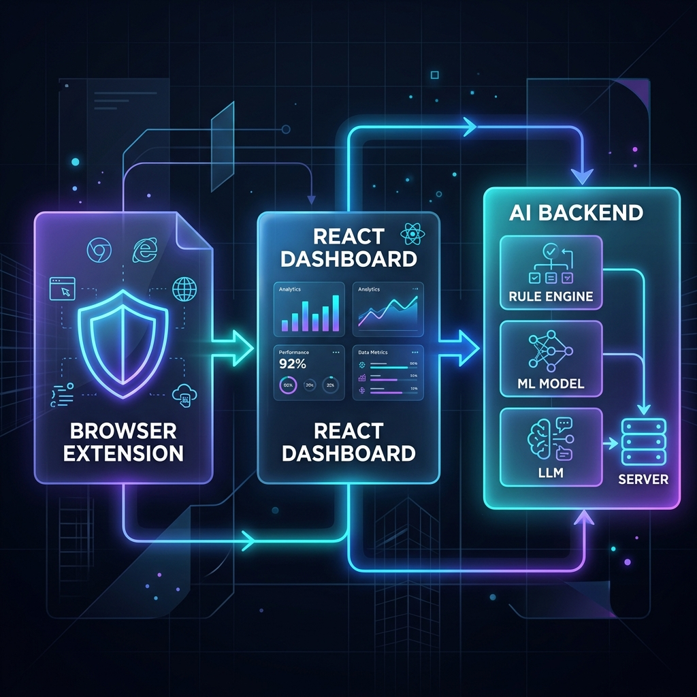

# ToxiGuard AI v3.0 — System Design Overview

Welcome to the system architecture of **ToxiGuard AI v3.0**! 

This document breaks down how the entire system works in a simple, visual way. The system is divided into three main components:
1. The **Browser Extension** (running on your device)
2. The **React Dashboard** (the web application)
3. The **AI Backend** (the intelligence engine)

---

## High-Level Architecture Diagram

> [!NOTE]
> The above diagram illustrates the flow of data. The **Browser Extension** intercepts social media feeds, the **React Dashboard** displays the analytics, and both connect to the centralized **AI Backend** for real-time processing.

---

## 1. Browser Extension (The Client)
The browser extension is the part of the system that lives in Chrome or Edge. It is built using modern **Manifest V3** standards.

* **What it does**: It watches the web pages you visit (like Instagram or Twitter).
* **How it works**: It uses a tiny background script to detect when you are scrolling through a feed. Instead of checking every single word, it intelligently groups text (debouncing) and sends it to the backend for analysis.
* **Special Feature**: It has a "Side Panel" and "Floating Button" that let you highlight any text on any website to check if it's safe.

## 2. AI Backend (The Brain)
When the browser extension finds text, it sends it to the **Python Backend**. To make sure we don't accidentally block harmless text (false positives), the text passes through a **3-Layer Hybrid Pipeline**:

1. **Layer 1: Rule Engine (The Bouncer)**
   * Instantly catches obvious bad words or severe threats using a fast dictionary lookup.
2. **Layer 2: Machine Learning Model (The Detective)**
   * A lightweight Transformer AI reads the sentence to understand the *sentiment* and context (e.g. knowing the difference between "I will kill you" and "you killed that performance").
3. **Layer 3: Large Language Model (The Judge)**
   * For very tricky sentences (sarcasm, complex slang), a deep LLM analyzes the text and explains *why* it is toxic in plain English.

* **The Ensemble Engine**: Finally, the system tallies the "votes" from all three layers to make a final, highly accurate decision on whether to block the text.

## 3. React Dashboard (The Control Center)
This is the beautiful web interface built with React.

* **What it does**: It acts as your control center.
* **How it works**: It connects to the AI Backend to fetch your historical data. It shows you exactly how many toxic comments were blocked, what words are most commonly used, and provides you with API keys if you want to use the AI engine in your own apps.

---

> [!TIP]
> **Summary**: The **Extension** finds the text, the **Backend** acts as a 3-layer filter to analyze it, and the **Dashboard** lets you monitor the results!
